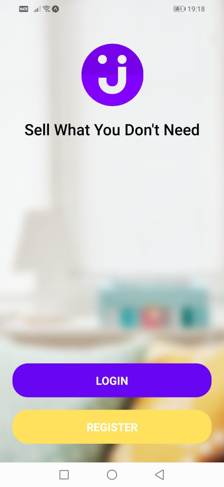
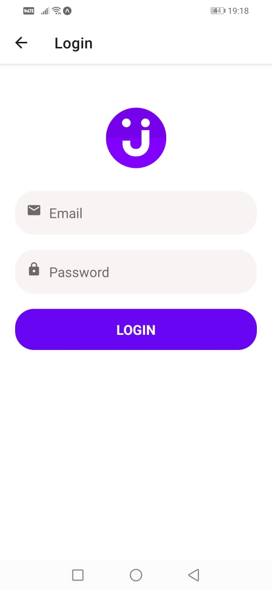
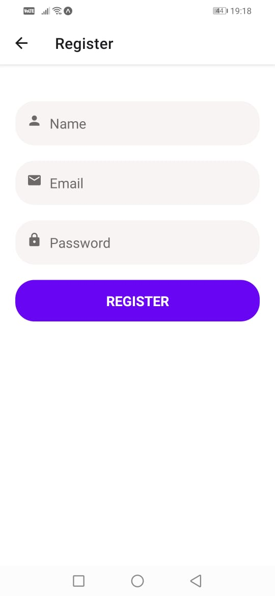
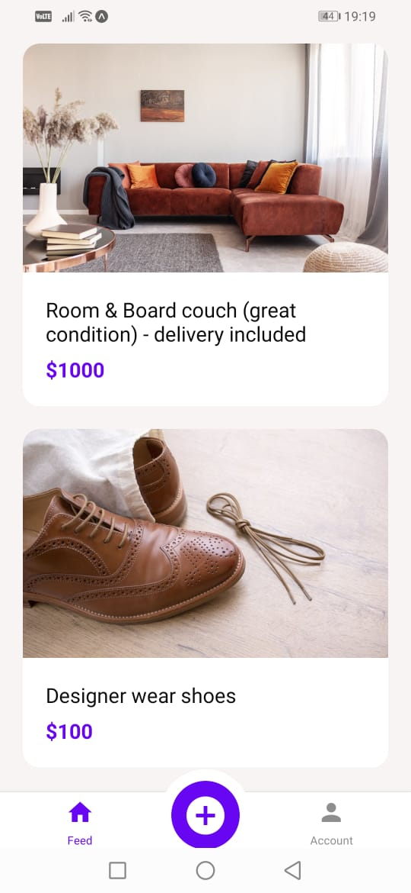
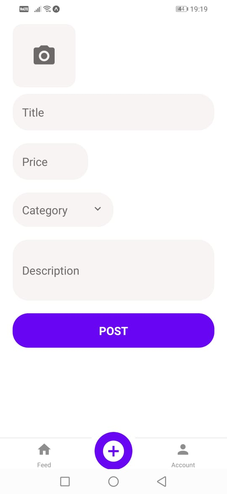
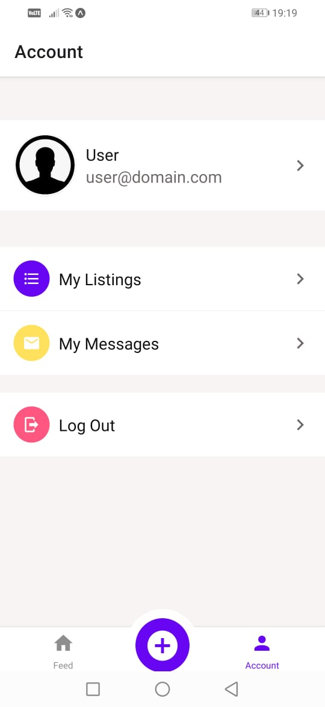

# SellIt App
> This repository contains the code for a mobile application built using React Native that allows users to buy and sell items. The app is compatible with both iOS and Android platforms.

### Link :link: [Click to view demo](./app-demo/demo.mp4)








### Features
- basic authentication
- Post method implementation, submit a form
- Get method implementation, display list of products
- Fetch data from API
- Animations
- run in Android and IOS devices

### Dependencies
- React-native
- Formik
- ApiSauce
- expo packages
- lottie-react-native
- nodejs
-----------------------------------------------
## Getting Started

These instructions will help you get a copy of the project up and running on your local machine for development and testing purposes.

### Installing

1. Clone the repository: `git clone https://github.com/Sindhuinti/SellIt-app.git`
2. Navigate to the project directory: `cd sellit-app`

## To run and test 

1. Install dependencies

``` 
npm install
```

2. Start local server
``` 
npm start
```
3. Start backend server
``` 
cd backend
nodemon index.js
```
4. Use Expo app to run the app

## Contributing

If you would like to contribute to the development of these tokens, please fork the repository and create a pull request.

## Author 

👩🏻‍💻  **[@Sindhu Inti](https://github.com/sindhuinti/)**


